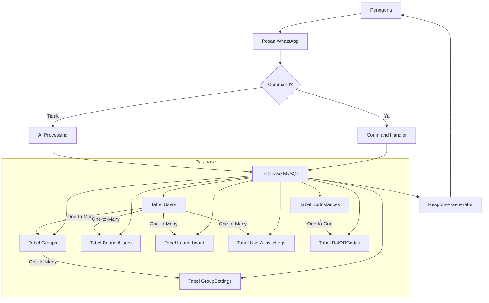

# Chatbot WhatsApp

<div align="center">
  
  
  [](https://opensource.org/licenses/MIT)
  [](https://nodejs.org/)
  [](https://www.mysql.com/)
</div>

Bot WhatsApp canggih berbasis Node.js menggunakan [Baileys](https://github.com/WhiskeySockets/Baileys) dengan fitur AI terintegrasi dan manajemen grup otomatis.

## 📑 Daftar Isi
- [Fitur Utama](#-fitur-utama)
- [Persyaratan](#-persyaratan)
- [Instalasi](#-instalasi)
- [Konfigurasi](#-konfigurasi)
- [Struktur Proyek](#-struktur-proyek)
- [Environment Variables](#-environment-variables)
- [Arsitektur Sistem](#-arsitektur-sistem)
- [Penggunaan](#-penggunaan)
- [FAQ](#-faq)
- [Lisensi](#-lisensi)
- [Kontribusi](#-kontribusi)

## 🚀 Fitur Utama
### 🤖 Integrasi AI
- Dukungan model GPT-3.5/4, Claude, Gemini
- Image generation dengan DALL-E 3
- NLP untuk pemrosesan pesan alami

### 📥 Downloader Konten
- YouTube (video/audio)
- Instagram (post/reel)
- Facebook (video)
- TikTok (video)

### 🎮 Sistem Game
- RPG berbasis teks
- Mini games (tebak gambar, trivia)
- Sistem leveling dan experience

### 🛡️ Manajemen Grup
- Auto welcome message
- Anti-spam/link
- Fitur admin (kick, ban, promote)
- Sistem voting

## 📋 Persyaratan
- Node.js 16.x+
- MySQL 8.0+
- RAM 2GB+ (Rekomendasi 4GB)
- Storage 500MB+ (Untuk media cache)

## 💻 Instalasi
```bash
# Clone repositori
git clone https://github.com/maousamaNatz/Oblivinx_jsbot.git
cd Oblivinx_jsbot

# Install dependencies
npm install

# Jalankan migrasi database
npm run migrate:fresh

# Mulai bot
npm run dev
```

## ⚙️ Konfigurasi
Buat file `.env` di root direktori:
```ini
# Database
DB_HOST=localhost
DB_USER=user
DB_PASSWORD=password
DB_NAME=natzbot

# API Keys
OPENAI_KEY=sk-xxx
COINMARKETCAP_KEY=xxx

# Konfigurasi Bot
PREFIX=!
MAX_CONCURRENT=5
SESSION_TIMEOUT=3600
RATE_LIMIT=10
```

## 📂 Struktur Proyek
```
Chatbot_whatsapp/
├── auth_info_baileys/    # Session storage
├── config/               # Konfigurasi aplikasi
│   ├── api/              # Integrasi API eksternal
│   ├── dbConf/           # Koneksi database
│   └── memoryAsync/      # Sistem penyimpanan
├── database/             # Skema dan migrasi DB
├── src/
│   ├── commands/         # Handler command
│   ├── handler/          # Sistem permission
│   ├── lib/              # Library eksternal
│   └── utils/            # Helper functions
├── bot.js                # Entry point
└── bot.sql               # Skema database
```

## 📐 Arsitektur Sistem


## 📝 Penggunaan
### Command Dasar
```
!help - Menampilkan menu bantuan
!ping - Cek status bot
!info - Info sistem bot
!donate - Support pengembangan
```

### Contoh AI
```
!gpt <pertanyaan> - Tanya ke GPT-4
!dalle <prompt> - Generate gambar AI
!translate <teks> - Terjemahkan teks
```

## ❓ FAQ
### 🔄 Reset Session
**Q:** Cara mereset session/login bot?  
**A:** 
```bash
1. Hapus folder auth_info_baileys
2. Jalankan ulang bot dengan `npm run dev`
```

### 🛠️ Error Database
**Q:** Muncul error koneksi database saat start bot?  
**A:** Lakukan pengecekan:
1. Pastikan service MySQL aktif
2. Verifikasi kredensial di `.env` sesuai
3. Cek port database (default:3306) tidak terblokir

### 📶 Bot Tidak Merespon
**Q:** Bot tidak merespon command/message?  
**A:** 
1. Cek file log terbaru di `logs/error.log`
2. Verifikasi koneksi internet server
3. Pastikan izin baca/tulis di folder project

### 🔄 Update Bot
**Q:** Cara update ke versi terbaru?  
**A:** 
```bash
git pull origin main
npm install
npm run migrate
```

### 🤖 Batas Penggunaan AI
**Q:** Kenapa command AI tidak bekerja?  
**A:** Kemungkinan karena:
- Limit API key tercapai
- Model AI tidak tersedia
- Error koneksi ke provider AI

## 📜 Lisensi
Proyek ini dilisensikan di bawah [MIT License](LICENSE) dengan tambahan ketentuan khusus ORBIT STUDIO:
- Dilarang komersialisasi tanpa izin
- Wajib mencantumkan credit
- Update lisensi berlaku retroaktif

## 🤝 Kontribusi
Lihat [CONTRIBUTING.md](CONTRIBUTING.md) untuk panduan lengkap. 

**Kontak Tim:**
- Email: dev@orbitstudio.id
- Discord: [Join Server](https://discord.gg/orbitstudio)
- Dokumentasi: [docs.orbitstudio.id](https://docs.orbitstudio.id)
